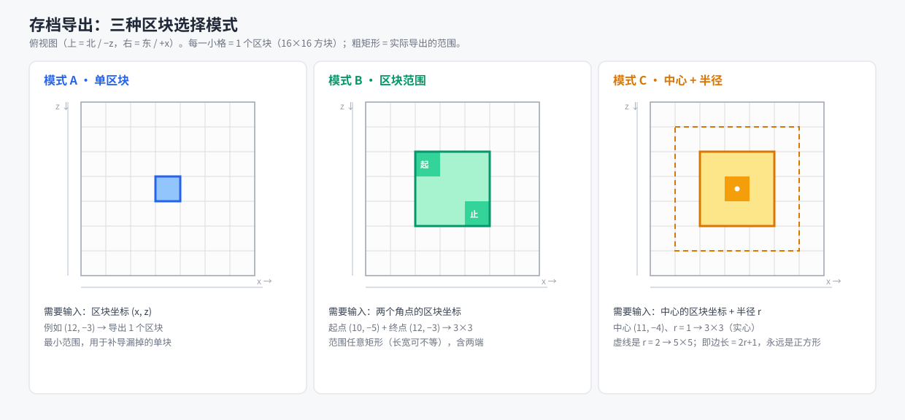

# LittleTiles Reader 桌面应用 · 设计文档

> 状态：**草案 v1**，由需求讨论整理而成，待评审。
> 配套：库 `minecraft-littletiles-reader`、生成端 `minecraft-littletiles-reader-tools`、
> 测试数据 `minecraft-littletiles-reader-data`（四个仓库同级）。

---

## 0. 已拍板的前提（2026-09-14）

| # | 结论 |
|---|---|
| 1 | 跨平台目标：**Windows + macOS**（Linux 不承诺） |
| 2 | 启动界面**两个入口同级**：大按钮 = 快速导出（不绑定项目、不留记录）；项目列表 = 项目模式（留记录与产物） |
| 3 | 点进项目 → **项目管理界面**：操作配置、导入导出、封面、材质包与 mod 绑定、历史记录、存储与清理，全在这里 |
| 4 | 存档备份 = **整个存档**打成 zip |
| 5 | 产物副本默认只记**清单 + 哈希**；需要时按记录**重建**（见 §7.6） |
| 6 | 一个项目**一套**素材组合（要多风格就多建项目） |
| 7 | 非项目模式的导出落到默认输出目录，**不进区块索引**（索引里的都是项目模式下导出的） |

---

## 1. 目标与范围

做一个**跨平台桌面应用**，把"素材组合 → 选存档 → 选区块 → 导出 OBJ/贴图"这条链路
从命令行搬到图形界面，并加上素材、模组、项目与导出记录的管理。

**做什么**

- 启动界面：项目列表（封面 / 名称 / 描述）+ 两个醒目入口（导出 SNBT、导出存档）
- 素材管理：导入材质包并自定义命名
- 模组管理：导入 jar，自动解析其中的方块贴图
- 项目管理：项目目录由用户指定，把绑定的材质包/模组连副本一起收进项目目录；
  记录导出历史、留输入与（可选）输出副本；可查询某区块是否导出过、何时导出
- 输出目录管理
- 存档备份（打成 zip 存进项目目录）

**不做什么**

- 不做服务器 / Web 服务（已明确）
- 不做 3D 实时预览（只导出文件；将来若要预览，另做一个独立查看器）
- 不在 UI 侧做烘焙或几何处理——那是库的职责（见 §3）

---

## 2. 技术选型

**Python 3.11 + PySide6（Qt Widgets）**，库以**子进程**方式调用。

理由：

1. **生成端已经是 Python**。素材组合、jar 解析、映射表归一化、manifest、tint、
   素材包 lint 全都现成（`minecraft-littletiles-reader-tools` 的 `ltgen/` 与 `tools/`），
   UI 直接进程内复用。若改用 C++ Qt，这套东西要在 C++ 里重写一遍。
2. **进程边界反而有利**：库目前不是线程安全的、会往 stdout 打印、且有全局状态。
   放进子进程刚好隔离噪声与崩溃；并行跑多个导出也只是多起几个进程。
3. UI 需要的都是常规控件（表单、列表、卡片、文件对话框、进度条、可滚动网格），
   Qt Widgets 全都成熟；区块选择那种格子用 `QGraphicsScene` 或自绘 widget 即可。
4. 跨平台：PySide6 官方支持 Windows / macOS / Linux。

**Qt Widgets 而非 QML**：本应用主体是表格与表单，QML 的动画优势在这里用不上，
反而更难写。

**许可**：PySide6 是 LGPL，动态链接下商用无碍；不走静态链接。

**已知取舍**

- 打包体积：PyInstaller/Nuitka 产物约 80–150 MB。想压小就用干净的 venv 装 PySide6
  再打包，别拿整个 conda 环境打。
- 超大文件（百 MB 级 OBJ）不要在 UI 侧读，交给库或只读清单。

---

## 3. 与库的边界：job 接口

> **权威契约已经落在库仓库的 [`docs/job.md`](../minecraft-littletiles-reader/docs/job.md)**，
> 本节只是应用侧的摘要；两者冲突时以那份为准。**M0 已完成**（2026-09-14）。

**这是整个应用的前置依赖。** 库现在只有交互式 CLI（启动后逐条提问、输出给人看的文本），
UI 无法可靠驱动。库侧要先加三样东西：

1. `--job <file.json>`：一次跑完，不再回问
2. 结构化进度（NDJSON，一行一个事件）
3. 明确的退出码（错误一行，退出码非 0）——**已完成**（畸形输入原本会卡死，已修）

### 3.1 job JSON（草案）

```json
{
  "schema": 1,
  "mode": "region",
  "input": {
    "world": {
      "root": "D:/saves/MyWorld",
      "dimension": "overworld"
    },
    "chunks": { "mode": "center", "x": 11, "z": -4, "radius": 1 }
  },
  "assets": { "package": "D:/app/cache/packs/9f2c1a4b" },
  "output": {
    "dir": "D:/projects/House/outputs/2026-09-14_0031",
    "name": "house"
  },
  "options": {
    "plain_blocks": true,
    "cull_hidden_faces": true,
    "center": true,
    "normalize_scale": false
  }
}
```

要点：

- **`world.root` 是存档根目录**（`.minecraft/saves/<世界>`，里面有 `level.dat` 与 `region/`），
  **不是 `region/` 本身**。由库负责拼 `<root>/region/`；
  维度非主世界时是 `<root>/DIM-1/region/`、`<root>/DIM1/region/`。
  → 库的 `AnvilReader` 入参语义要跟着调整（现在收的是 region 目录）。
- `chunks` 用"模式 + 参数"表达（见 §6），由库展开；UI 侧为了画预览格会算同一套规则，
  规则本身只有三行，允许这点重复。
- `snbt` 模式时 `input` 换成 `{ "snbt": { "path": "..." } }`；
  **粘贴文本在 UI 侧先落成文件**再传路径。
- `assets.package` 指向一个已组合好的素材包目录（由生成端产出，见 §7.3）。
- `output.dir` 由宿主指定——库从不决定产物落在哪（这条已经实现了）。

### 3.3 还缺一项：贴图写进内容寻址库（M0.5）

§7.6 要的"贴图按哈希存一次、MTL 指过去"目前**没有库侧支持**：现在 builder 只会把
PNG 写进 OBJ 旁边的 `<obj 名>_textures/`。两条路：

| 方案 | 说明 |
|---|---|
| A 库支持 | `ObjExportOptions` 加一个"贴图库根目录"，库负责按内容哈希命名、已存在则跳过，并让 `map_Kd` 指向它；`Stats` 回报这次用到的哈希清单 |
| B 宿主后处理 | 导出后由 UI 把 `_textures/` 里的 PNG 移进哈希库、删掉重复、改写 MTL 的 `map_Kd` |

推荐 **A**：改写 MTL 是库自己的格式知识，宿主不该碰；而且只有库知道每张图的来源
（哪张贴图 × 哪种烘焙），哈希清单由它回报最自然。这也让"重建"只依赖 job + 记录。

### 3.2 进度事件（草案）

stdout 每行一个 JSON；`--progress json` 打开，默认仍是人类可读文本（CLI 老用户不受影响）。

```json
{"event":"start","chunks":9,"assets":"9f2c1a4b"}
{"event":"chunk","index":1,"total":9,"x":0,"z":0,"tiles":236}
{"event":"stage","name":"write","done":true}
{"event":"done","obj":".../house.obj","faces":4940,"materials":6,"textures":6,"seconds":1.0}
{"event":"error","message":"SNBT parse failed (position 3): trailing content ..."}
```

UI 只认这个流：进度条吃 `chunk`，日志面板吃全部，失败看 `error` 或退出码。

---

## 4. 目录与配置布局

### 4.1 应用级（便携式，紧挨程序）

```
<应用目录>/
├── config/
│   └── app.json            项目登记表、默认输出目录、UI 偏好、受管资源索引
├── resources/
│   ├── packs/<你起的名字>/   导入的材质包（解包后的标准素材包或原始压缩包 + 元信息）
│   └── mods/<名字>/         导入的模组（jar 或解包结果 + 解析出的材质索引）
├── cache/
│   ├── packs/<组合指纹>/     组合好的素材包（原版+资源包+模组）
│   └── covers/              项目封面缩略图
└── logs/
```

> ⚠️ 「配置文件留在应用程序所在目录」在安装到 `Program Files` 时会失败（目录只读）。
> 开发期和便携版没问题；**打包时要么装到用户可写目录，要么回退到 `%APPDATA%`**。
> 见待定项 #1。

**受管资源 = 复制进来**（不是登记原路径），所以用户删掉原始文件也不影响；
登记项记「名字 + 来源路径 + 指纹」，便于回溯与判重。

### 4.2 项目级（目录由用户指定）

```
<项目目录>/
├── project.json         名称、描述、封面、绑定的素材与模组、默认导出选项
├── cover.png            封面原图（缩略图缓存在应用目录）
├── packs/               本项目绑定的材质包副本
├── mods/                本项目绑定的模组副本
├── inputs/
│   ├── snbt/            每次 SNBT 导出的输入副本（小，始终留）
│   └── saves/           手动触发的存档备份 zip
├── textures/            贴图内容寻址库（CAS）：<哈希前2位>/<sha1>.png
├── outputs/             每次导出一个时间戳目录
│   └── 2026-09-14_0031_house/
│       ├── house.obj       这次导出的模型（保留）
│       ├── house.mtl       材质表，map_Kd 指向 ../../textures/...
│       └── job.json        这次的 job 参数，重建与复现靠它
└── records/
    ├── index.json       区块索引（查询用，轻量）
    └── <导出 id>.json    单次导出的完整记录（含贴图哈希清单）
```

**贴图不放进每次导出的目录**：同一张烘焙结果在多个导出里出现时，只在
`textures/` 里存一份（按内容哈希命名）。导出目录里只有 OBJ / MTL / job.json，
所以"按时间留一份产物"不会让磁盘按导出次数翻倍增长。

**两份数据的一致性问题**：项目目录是用户自定义位置的，所以"项目列表"不能只靠扫目录树。
应用配置里存**登记表**（路径 + 封面缩略图），项目内 `project.json` 是**权威**。
启动时按登记路径逐个读：

- 读不到 → 列表里显示「项目不可用」，给「重新定位」按钮
- 能读到但 `project.json` 与登记表不一致（比如项目被搬到别的盘）→ 以项目内为准，更新登记表

---

## 5. 界面结构与流程

```
启动界面
├── 项目列表（卡片：封面 · 名称 · 描述）
│    ├── [新建 / 添加项目]
│    └── 点击卡片 → 项目工作界面
└── 两个醒目入口
     ├── [导出 SNBT]   txt 文件 / 粘贴文本
     └── [导出存档]    选存档 → 选区块 → 导出
          └─→ 问：是否配置材质包 / 模组方块？→ 是则打开对应管理界面

项目管理界面（点进某个项目后，这个项目的一切都在这里）
├── 顶部：两个大区域 —— [导出 OBJ 模型] / [导出 SNBT]
│    └── 点"导出 OBJ" → 直接弹出"导出哪个区块"（§6）
├── 基本配置：名称、描述、封面、项目目录（可改，改时提示是否搬移已有数据）
├── 存档配置：本项目的默认存档地址（存档根目录）
├── [备份存档]  备份整个存档，打成 zip 存进 <项目>/inputs/saves/
├── 素材配置：本项目绑定的材质包与 mod（增删、拖动调优先级）
├── 导入 / 导出：把项目配置导出成一个包（换机器或备份用），以及从包导入
├── 历史记录：导出历史 + 区块查询（§6 的三态网格），可多选删除、可重建贴图
├── 存储：大小统计与分类占比（§7.8）、清理策略（§7.7）
└── 组合状态：本项目的素材包"已就绪 / 需要重新组合"（§7.3）

管理界面（从启动界面或项目界面进入）
├── 素材管理：导入材质包 + 命名 + 查看内容（方块数/贴图数/缺失）
├── 模组管理：导入 jar → 自动解析方块与材质
├── 输出目录管理：默认输出目录、各来源的输出目录
└── 项目管理：新建/删除/重定位、封面、描述、绑定关系
```

> SNBT **不需要备份**：每次导出已经在 `<项目>/inputs/snbt/` 留了输入副本。

---

## 6. 区块选择（三种模式）

所有从存档出发的导出都让用户自选**存档根目录**，然后按下面三种方式之一选区块。

| 模式 | 需要用户输入 | 展开规则 |
|---|---|---|
| A 单区块 | 区块坐标 `(x, z)` | 1 个区块 |
| B 区块范围 | 两个角点 `(x₁,z₁)`、`(x₂,z₂)` | 任意矩形，含两端 |
| C 中心 + 半径 | 中心 `(x,z)` + 半径 `r` | 边长 `2r+1` 的正方形 |



（图：`docs/chunk-selection-modes.svg`）

**预览网格要把"导出过没有"直接画出来**——这正是记录查询最自然的用法：

| 格子颜色 | 含义 |
|---|---|
| 灰 | 从未导出 |
| 绿 | 已导出，且存档未变 |
| 黄 | 已导出，但 `region` 文件自那以后变过（可能需重导） |
| 蓝框 | 当前选择范围 |

---

## 7. 记录、查询与副本

### 7.1 区块身份

**光靠坐标不行**：不同世界的 `(0,0)` 是两个完全不同的区块。索引键定义为：

```
(世界目录规范化路径, 维度, chunk x, chunk z)
```

世界另存一份指纹用于识别"同一个世界的副本 / 被搬走的世界"：
`level.dat` 的大小 + mtime + `LevelName`。

### 7.2 三态判定（"导出过没有 / 什么时候"）

记录里存**导出当时该区块所在 `.mca` 文件的大小与 mtime**。查询时对比当前值：

| 状态 | 条件 | UI 表现 |
|---|---|---|
| 未导出 | 索引里没有该 (世界, 维度, x, z) | 灰 |
| 已导出 | 有记录，且 mca 的大小+mtime 与记录一致 | 绿 + 显示导出时间 |
| 可能已过期 | 有记录，但 mca 变了（玩家又玩过这个世界） | 黄 + 显示"导出于 X，存档此后已修改" |

这比"只记有没有导出过"有用得多：玩家回去盖了几间房再导，UI 会主动提示。

### 7.3 素材组合与缓存

项目绑定的"材质包 + 模组"要在导出前合并成一个**素材包目录**（原版 → 资源包 → 模组叠加，
后者覆盖前者）。合并要解 jar、解析 blockstate、抠贴图，几秒到几十秒，**必须缓存**：

- 缓存键 = 有序来源列表 `(类型, 名字, 指纹)` + 格式版本，取哈希作为目录名
- 位置：`<应用目录>/cache/packs/<哈希>/`
- 任一来源指纹变化 → 新键，旧缓存可清理
- UI 上显示「素材包：已就绪 / 需要重新组合」

多个材质包的顺序由用户在项目详情页拖动排序（游戏里后加载的覆盖先加载的）。

### 7.4 每次导出的落盘内容

只有**项目模式**留记录与产物。一次导出产生：

| 内容 | 处理 |
|---|---|
| OBJ + MTL | **留在** `outputs/<时间戳>_<名字>/`，这是"这次的产物" |
| job.json | **留在**同一目录，重建与复现靠它 |
| 贴图 | **不放在导出目录**，进 `textures/` 内容寻址库；MTL 的 `map_Kd` 指过去 |
| 记录 | 写进 `records/`，含贴图哈希清单、区块索引、大小统计 |
| SNBT 输入副本 | 始终留（几十 KB ~ 1 MB） |
| 存档备份 zip | 用户手动触发，**备份整个存档** |

### 7.5 时间戳目录与命名

```
outputs/2026-09-14_0031_house/
```

- 时间戳形如 `YYYY-MM-DD_HHMM`，同一分钟内重复导出加 `_2`、`_3`
- 后缀是这次导出的名字（SNBT 用结构名，存档用区块范围，例如 `c12_-3_r1`）
- 目录只读：应用不往里追加东西，重新导出就是新目录（可追溯，不会互相覆盖）

### 7.6 贴图按哈希管理 + 按需重建

**存储**：`textures/<哈希前2位>/<sha1>.png`，内容寻址。同一张烘焙结果被多个
导出用到时只存一份；写之前先算哈希，已存在就跳过。索引记"哪次导出用了哪些哈希"。

**重建**：贴图可在清理时被删（见 §7.7），记录里的哈希清单变成"缺失"。这时提供
一个**重建按钮**：拿这次的 `job.json` + 当时绑定的素材组合重新跑一遍导出，
把需要的贴图重新烘焙出来。所以清理是安全的——丢的是算力能买回来的东西。

重建需要"当时那套素材"。项目绑定的素材包/mod 副本就在项目目录里，组合缓存按
内容指纹寻址（§7.3），所以只要项目没被改过就能重现同样的输入。**改过项目的素材
绑定之后，旧记录的重建结果可能不同**——这一点要在 UI 上说明。

### 7.7 清理策略

两种方式，都只作用于"可选内容"（贴图 CAS、导出目录、存档备份）：

| 方式 | 说明 |
|---|---|
| 主动删除 | 在历史记录里多选 → 删除；或按类别清理（例如"删掉所有没被记录引用的贴图"） |
| 定期删除 | 每项目可设：只保留最近 N 次导出 / 超过 X 天的自动删 / 总大小超过 Y GB 时提示或自动清理最旧的 |

默认**不自动删任何东西**，只提示；清理前显示"将释放多少空间"。**永不删除**
`records/` 的索引和 `inputs/snbt/`——它们很小，是追溯与重建的依据。

### 7.8 大小统计与占比

每个项目显示一个**总量 + 分类占比**，让"磁盘被谁吃了"一眼可见：

```
house 项目 · 共 412 MB
████████████████████████░░░░░░░░░░░░░░░░░░  60% 贴图 CAS        247 MB
██████░░░░░░░░░░░░░░░░░░░░░░░░░░░░░░░░░░░░  15% 存档备份         62 MB
███░░░░░░░░░░░░░░░░░░░░░░░░░░░░░░░░░░░░░░░  10% 导出模型(OBJ)    41 MB
██░░░░░░░░░░░░░░░░░░░░░░░░░░░░░░░░░░░░░░░░   8% 素材包副本       33 MB
█░░░░░░░░░░░░░░░░░░░░░░░░░░░░░░░░░░░░░░░░░   5% 模组副本         21 MB
▏░░░░░░░░░░░░░░░░░░░░░░░░░░░░░░░░░░░░░░░░░   2% 记录与输入副本    8 MB
```

- 形式：一条**堆叠占比条** + 分类列表（颜色圆点 / 名称 / 大小 / 百分比）。
  不用饼图：类别会增减，堆叠条更好比较也更省地方。
- 分类：贴图 CAS、导出模型（OBJ+MTL）、存档备份、素材包副本、模组副本、记录与输入副本。
- 列表按大小降序；每类可点开看明细（哪几次导出、哪几次备份），并能就地删除。
- 这几个类别色要在深浅背景下都能区分——写进 UI 规范。

---

## 8. 里程碑

按依赖排序，M0 是硬前置。

- **M0（库侧）** `--job` 非交互入口 + 结构化进度 + `world/dimension` 解析 + 输出目录显式传入。
  不需要 UI 就能验证（拿现成的命令行 + 测试数据跑）。
- **M1（应用骨架）** 配置加载、路径解析、子进程调用与进度解析、日志面板；
  打通"选存档 → 选区块 → 导出"最小闭环。
- **M2（项目管理）** 列表/封面/详情/新建/自定义目录/重定位。
- **M3（资源管理）** 材质包导入与命名、jar 导入与解析、组合与缓存。
- **M4（记录与查询）** 区块索引、三态着色、副本管理与保留策略。
- **M5（打包）** PyInstaller/Nuitka + 随包分发 `LittleTilesReader` sidecar。

M2 与 M3 互不依赖，可以并行。

---

## 9. 这个文档

- 相关仓库：库 `minecraft-littletiles-reader`（`docs/assets-package.md` 是素材包契约）、
  生成端 `minecraft-littletiles-reader-tools`（`ltgen` 提供 lint / manifest / tint）、
  测试数据 `minecraft-littletiles-reader-data`。
- 本文件是需求整理的产物，改动请直接改这里，别再散回聊天。
